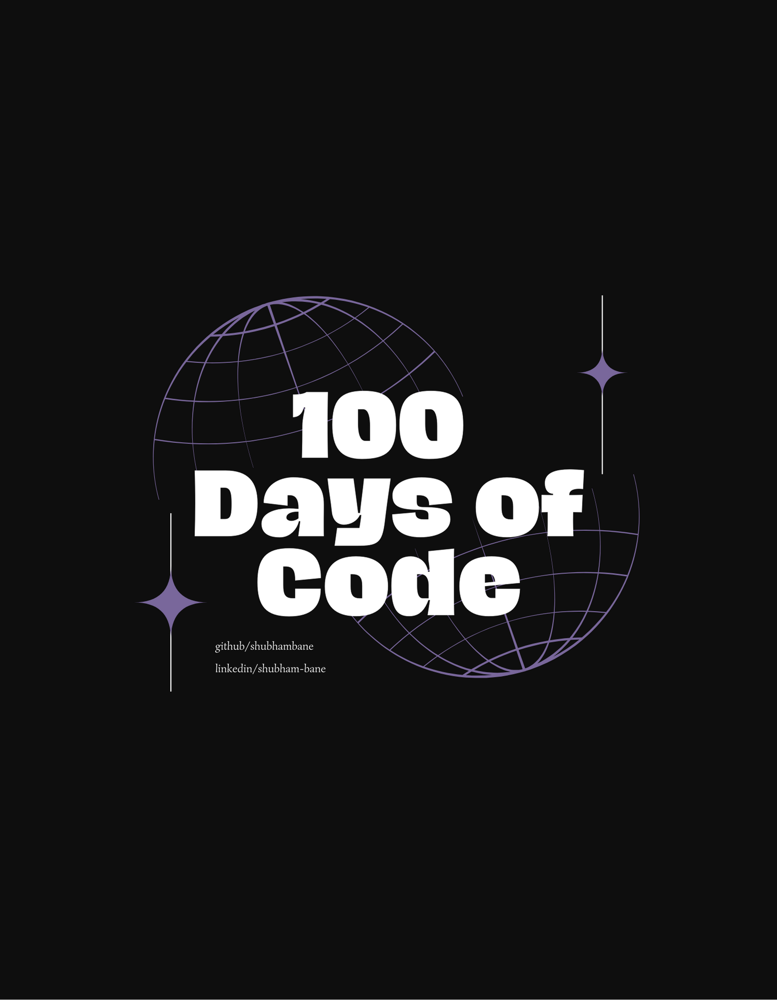

# Shubham's 100 Days of Code Challenge

## Welcome to My Coding Journey!

Hey there! I'm Shubham, and I'm embarking on an exciting coding adventure. Join me as I dive into a 100-day challenge where I'll be crafting beautiful UI designs and transforming them into Flutter code. 🚀

### The Challenge

- **What I'll Do**: Every Tuesday, Thursday and Saturday, I'll pick a UI design and code it in Flutter.
- **Why Flutter?**: I'm passionate about mobile & web app development, and Flutter is my weapon of choice!
- **Sharing is Caring**: All my code will be open-source and available right here on GitHub.

### How Can You Get Involved?

It's super easy! Just drop your favorite UI designs in the comments of my latest #100daysofcode challenge post, whether they're your creations or designs you admire. I'll pick from there, and your design might be the next one I bring to life!

### Stay Tuned

I'll be posting updates on LinkedIn, so be sure to follow me there for daily progress reports, insights, and some Flutter magic. Let's code together and make these 100 days count! 💻✨

[LinkedIn Profile](https://www.linkedin.com/in/shubham-bane)
 
[Check out the code](https://github.com/shubhambane/100daysofcode)

---

