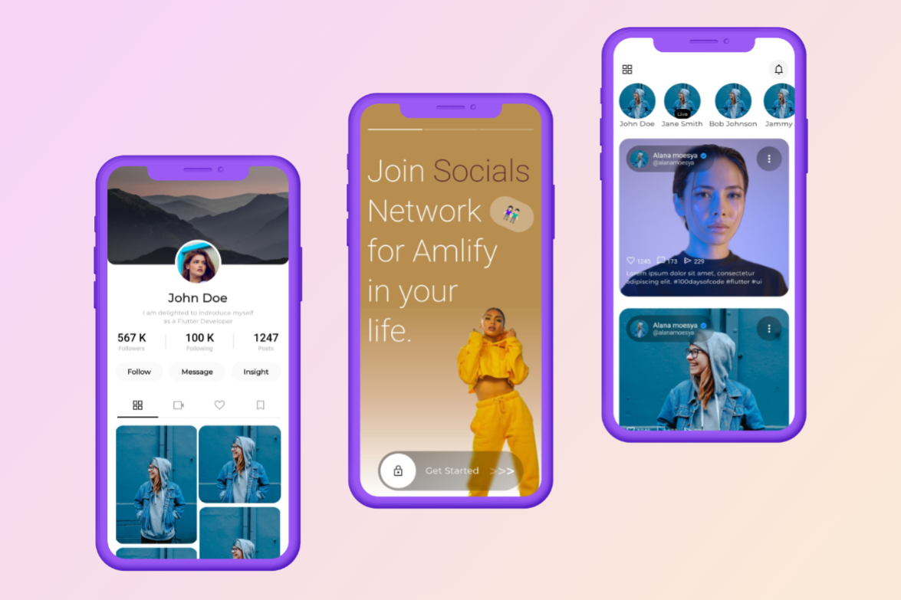

# Day 01: Social Media App

## Project Overview

Welcome to Day 01 of my #100DaysOfCode Challenge! 🚀 Today, I've brought to life an exciting Social Media App. This project is inspired by a fantastic design from [Dribbble](https://dribbble.com). I want to extend my heartfelt thanks to the brilliant designer for the inspiration!

### App Highlights

- **Stunning Design**: The app features a sleek and modern design that captures the essence of social interaction.
- **User Profiles**: Users can create profiles, customize avatars, and connect with friends.
- **Feeds & Posts**: Share moments, photos, and stories with friends and followers.
- **Notifications**: Stay updated with real-time notifications.

### Credits

I'd like to give credit to the amazing design that inspired this project. You can check out the original Dribbble design [here](https://dribbble.com/shots/22711057-Babagang-Social-Media-Mobile-App).

### How to Run

To explore this project on your local machine, follow these simple steps:

1. Clone this repository: `git clone https://github.com/shubhambane/100daysofcode.git`
2. Navigate to the project folder: `cd flutter/day01_flutter_socialmedia`
3. Get packages: `flutter pub get`
4. Run the project: `flutter run`

Feel free to explore the code and provide feedback. Your input is highly appreciated!

### Stay Tuned

Stay tuned for more exciting projects in the coming days! Follow my #100DaysOfCode journey on [LinkedIn](https://www.linkedin.com/in/shubham-bane) for daily updates and insights. Let's code together and make these 100 days count! 💻✨

[GitHub Repository](https://github.com/shubhambane/100daysofcode/tree/main/flutter/day01_flutter_socialmedia)
 
[LinkedIn Post](https://www.linkedin.com/posts/shubham-bane_100daysofcode-100daysofcode-flutter-activity-7115538845353308161-9srN)

---
